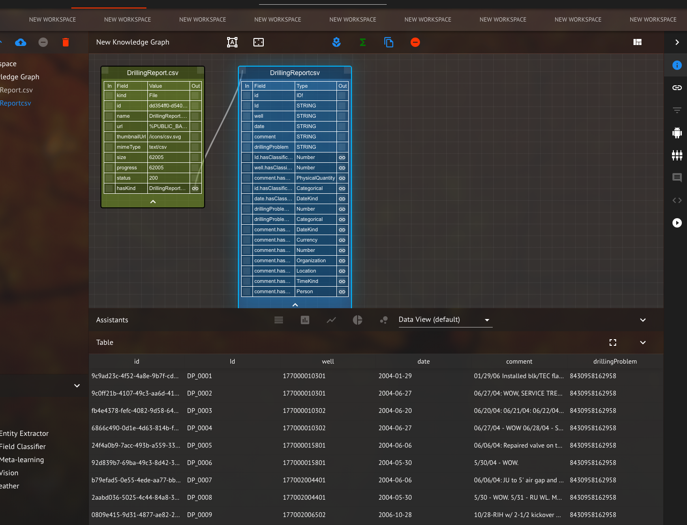
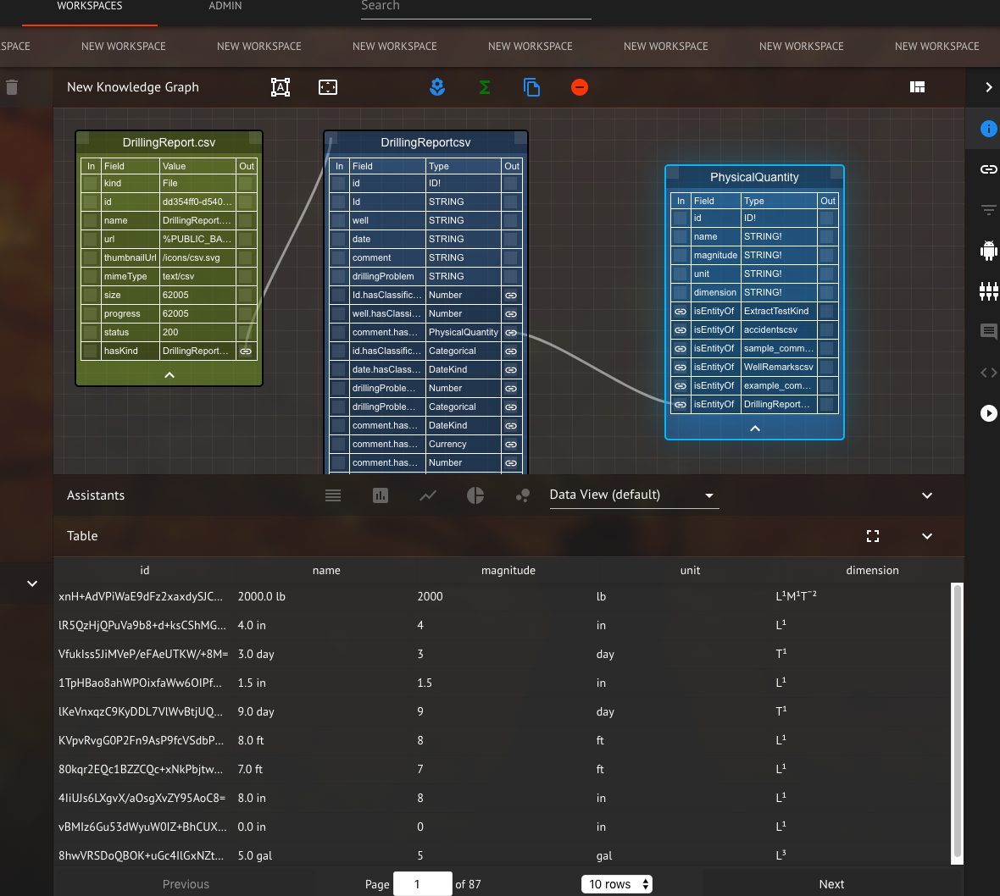

# Maana Entity Extractor

The entity extractor calls the NER service, but allows the user to specify a kind as input.  The results are stored in kinds and links.
The following mutation uses extractAndLink to both extract, store data and create links.  First upload a csv file to maana (in this case [DrillingReport.csv](DrillingReport.csv))  Record the kindId for the created kind and we will compute the entities in the "comment" field.  Run the below extraction. 

```
mutation {
  extractAndLink(kindId: "af6b3954-9e95-4391-bafc-57b207ed14c9", fieldName : "comment") {
    id
    errors
  }
}
```
with result
```
{
  "data": {
    "extractAndLink": {
      "id": "1b7ee95d-216c-42a4-8895-f0ea1b986ba9",
      "errors": []
    }
  }
}
```
The kind will now have several "hasEntity" links that link to the kinds where the entities are stored
<p><p>
</p>
<em>Figure 1: View after uploading CSV and running the entity extractor on the kind.  The hasEntities links at the bottom of the kind are the extracted entities.</em>
</p>
Clicking on the PhysicalQuantity link to produce the Physical Quantity kind, and then making sure the Physical Quantity kind is
selected, the following view should be visible - showing the extracted Physical Quantity data.
<p><p>
</p>
<em>Figure 1: View showing the Physical Quantity kind and some of the entities that were extracted.</em>
</p>
Many other entities are extracted based on the entities defined in the maana-ner service include Person, Location and Organization.  The extracted data can now be used as part of a larger pipeline.

