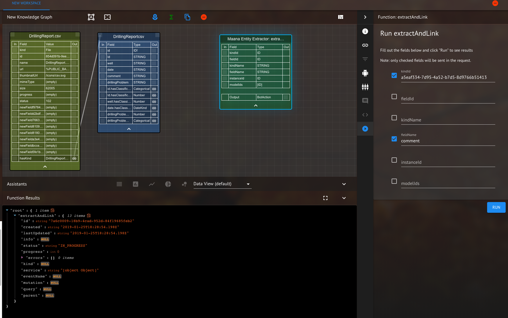
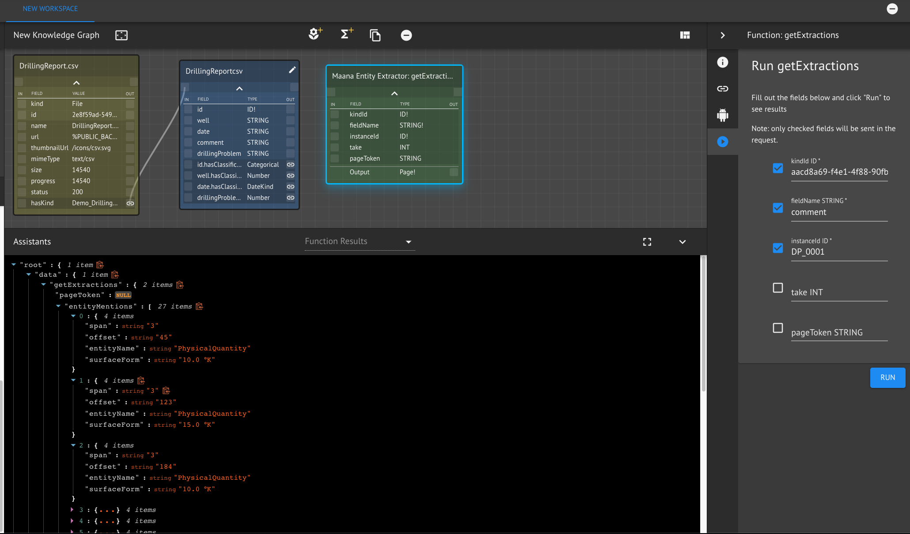

# Maana Entity Extractor

The entity extractor calls the NER service, but allows the user to specify a kind as input.  The results are stored in kinds and links.
The following mutation uses extractAndLink to both extract, store data and create links.  First upload a csv file to maana (in this case [DrillingReport.csv](DrillingReport.csv))  Record the kindId for the created kind and we will compute the entities in the "comment" field.  In the services inventory, drag the
extractAndLink function from the Maana Entity Extractor onto the workspace.  Copy the id from the "DrillingReportscsv" kind.  Select the extractAndLink function and click on the arrow button on the right hand side panel.  Fill in kindId with the kind id for "DrillingReportscsv" in the fieldName set the value to "comment" and press the run button.  The results are shown below 

<em>Figure 1: View after running the extractAndLink function on the "comment" field of the kind "DrillingReportscsv".</em>

The kind will now have several "hasEntity" links that link to the kinds where the entities are stored

<em>Figure 1: View after uploading CSV and running the entity extractor on the kind.  The hasEntities links at the bottom of the kind are the extracted entities.</em>

Clicking on the PhysicalQuantity link to produce the Physical Quantity kind, and then making sure the Physical Quantity kind is
selected, the following view should be visible - showing the extracted Physical Quantity data.

<em>Figure 1: View showing the Physical Quantity kind and some of the entities that were extracted.</em>

Many other entities are extracted based on the entities defined in the maana-ner service include Person, Location and Organization.  The extracted data can now be used as part of a larger pipeline.

To grab the extractions you need to call the getExtractions query and provide a kindId, fieldName and instanceId as shown below

<em>Figure 1: View showing the result of the getExtractions query.</em>

