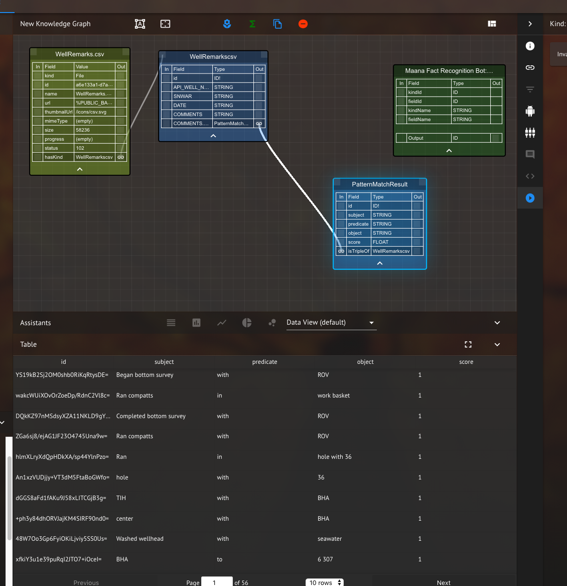
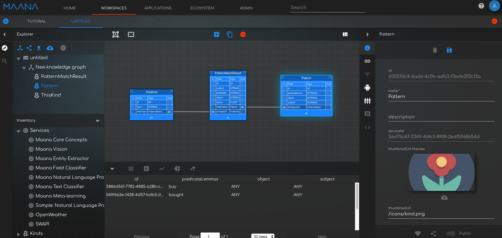
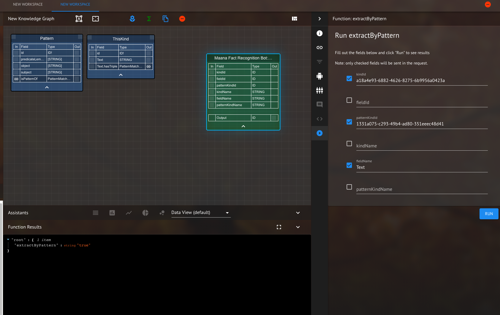
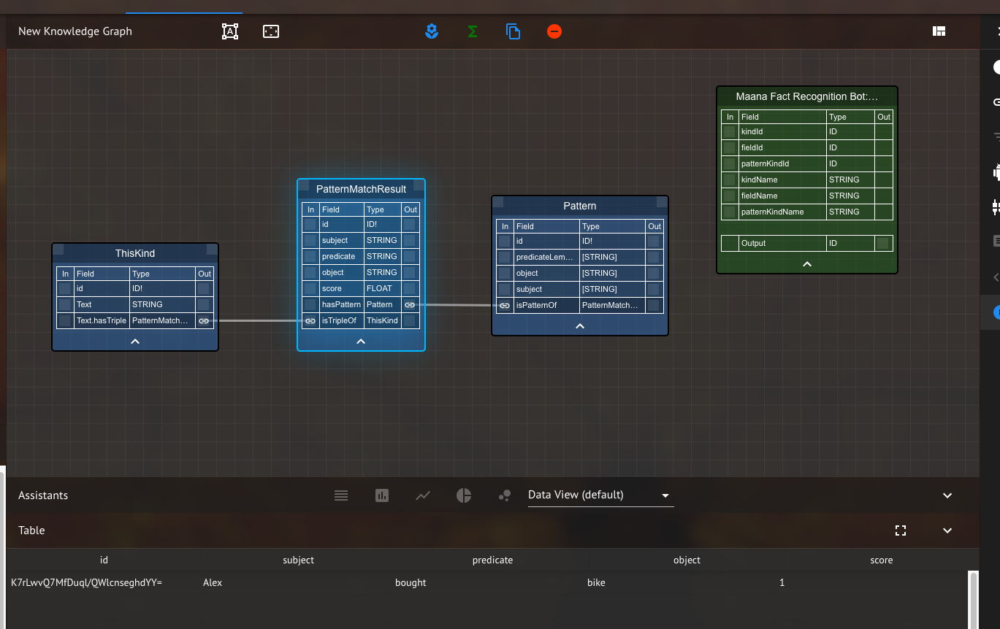
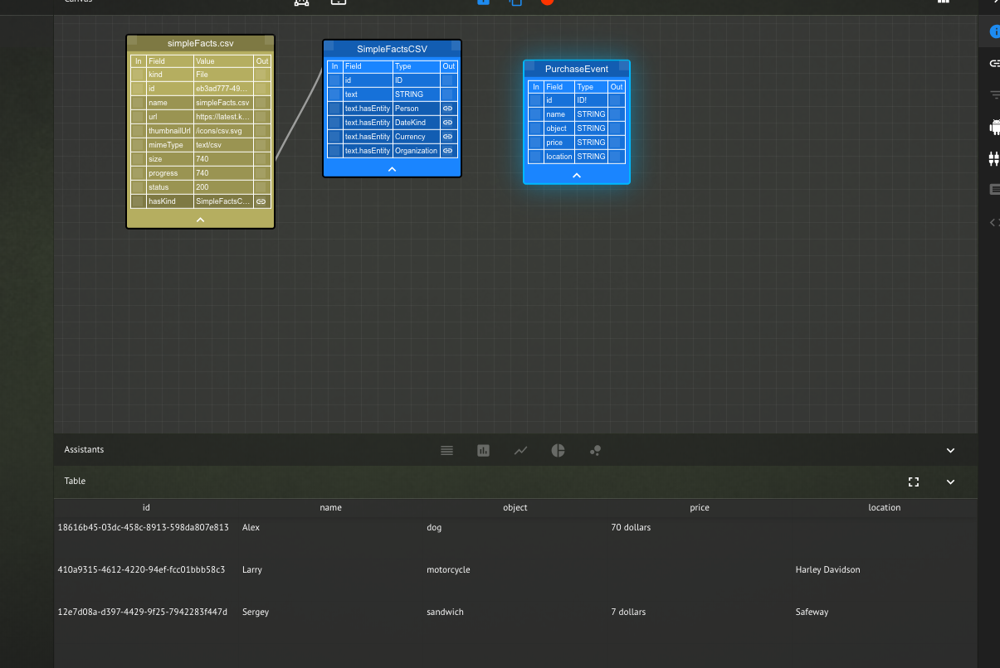

# Maana Fact Recognition Bot

The Fact Recognition Bot uses the Fact Recognition service to extract facts from kinds and store them in Maana. The simplest way to apply information extraction is to use the mutation extractTriples and apply it to a kindId and a fieldName. In this case, lets apply triple extraction to the file [WellRemarks.csv](WellRemarks.csv) which should be loaded onto the workspace.  A kind will be created named "WellRemarkscsv", copy that kind id.  Drag the extractTriples function from the the Maana Fact Recogntion Bot in the service inventory onto the workspace.  Click the arrow button on the right hand panel and enter the kindId of the "WellRemarkscsv" kind.  Fill out the rest of the fields as shown below, and press the run button.  The result should look like that in the figure below.

<p><p>
</p>
<em>Figure 1: Function executing the extractTriples graphql query</em>
</p>

The triples are extracted from the kind specified by 'kindId' in the provided fieldName and then stored in the kind 'PatternMatchResult'.  Search for the kind PatternMatchResult to see the entries from the extraction.

<p><p>
</p>
<em>Figure 2: Result shown in the PatternMatchResult kind</em>
</p>

### Fact Extraction With Pattern Filter

In order to use the fact extraction service (information extraction) you need

(1) a kind containing text fields from which you will extract facts (shown below as ThisKind).

(2) a kind that contains the desired patterns you wish to extract (shown below as Pattern). The schema of the pattern kind is 3 string lists named predicateLemmas, subject and object. The predicateLemmas is a list of predicates "[buys,bought,are]", the service expands these predicates to include related words. The predicateLemmas can have any values, the subject and object however, are restricted to values accepted in the entity extractor - the catch all is "["ANY"]", but can more generally be "["PERSON","LOCATION","ORGANIZATION",...]"

### Creating The Patterns Kind

The Pattern kind (which can have any name) can be created manually. Add a new kind to the workspace (name it "Pattern"), edit the schema to include "predicateLemmas" of type String with modifier LIST, "object" of type String with modifier LIST and "subject" of type String with modifier LIST. Now select the base "workspace" in the left hand panel (often called "New Workspace" if you have not named your workspace), this will bring up the the workspace graphiql in the bottom panel. In the right hand panel of graphql select mutation and scroll down until you see the mutation "addPattern" mutation

<p><p>
</p>
<em>Figure 3: The Pattern kind used for filtering triples</em>
</p>

You can now use that mutation to create the Pattern instance

```ruby
mutation {
  addPattern(
    input: { predicateLemmas: ["buy"], subject: ["ANY"], object: ["ANY"] }
  )
}
```

Remember, to set the predicateLemmas to a relation/relations that you expect to have in your data. "are" for example is a very common relation. Next, upload a csv file where at least one of the fields contains text with relations in it - or you can create a kind manually and add the text "Alex bought a bike".

Next create a kind containing the text you wish to extract - call it "ThisKind". It should have a field called "Text", and should have an instance with the the value "Alex bought a bike".

```ruby
mutation b {
  addThisKind(input: { Text: "Alex bought a bike" })
}
```

After you have have created the 2 kinds you can run the fact extraction, it's currently run manually.

(1) Select the Maana Entity Extractor service

Inside the graphiql for the service use the following mutation (In the mutation below the fieldName is "Text", but that should be the name of the field containing the text you want to extract.) Notice that below, kind ID's are used and not names. "kindId" refers to the ID for "ThisKind" and "patternID" refers to the ID for "Pattern".

<p><p>
</p>
<em>Figure 4: Result of running the extractByPattern function on the "Pattern" and "ThisKind" kinds</em>
</p>

This will extract facts from the kind "ThisKind" in field "Text" using the patterns defined in "Pattern". The results of the query will be a list of links ids. The extracted facts will be stored in the kind "PatternMatchResults" and links back to "ExtractTestKind" and "TriplePatterns" will also be generated.

How do you see the results?
The results are stored in the system kind (kind automatically generated at startup) called PatternMatchResult. All patterns are appended to this kind with links back to the original data and to the pattern that was used to extract the data. For this particular case, the result is the following "subject","predicate","object" in the PatternMatchResult Kind

<p><p>
</p>
<em>Figure 5: Result shown in the PatternMatchResult kind</em>
</p>

### Structure Mapping (Extraction by Example) / Slot Filling

The user can also extract data by example (slot filling) using structure mapping. In this case, the user wants to extract information from text similar to "Carl bought a fish for 5 dollars at the store" and store the information in a kind with fields "name","object","price","location". In this case the user needs to provide example(s) and their associated mapping(s). The example would be "Carl bought a fish for 5 dollars at the store", the mapping is

```json
{ "name": "Carl", "object": "fish", "price": "5 dollars", "location": "store" }
```

The example sentence is compared to a data source and results are extracted and stored in a kind. The interface for this capability is implemented with 2 different mutations

In the first case the user needs to specify the kindId (the source of the text where data will be extracted from), storageKindId (the location where the extracted data will be stored), the fieldName (the name of the field in kindId to be used), the example sentence (example) and the mapping to tell how the different terms in the example sentence map to the kind.

```ruby
extractByExample(kindId: ID, fieldId: ID, storageKindId: ID, fieldName: String, storageKindName: String, kindName: String, mapping: [CorrespondenceInput], example: String): [ID]
```

In the second case instead of an example, mapping and storageKind a "exampleKind" is provided which contains the same information. The exampleKind contains a list of examples, their mappings and the target kind. The results are stored in their respective kinds.

```ruby
extractByExampleKind(kindId: ID, fieldId: ID, exampleKindId: ID, kindName: String, fieldName: String, exampleKindName: String): [ID]
```

In order to experiment with these tools, first upload the file [simpleFacts.csv](simpleFacts.csv) into Maana and store the Id of the associated Kind it creates. Next, create a kind to store the results in, name this kind "PurchaseEvent" and it should have the schema "{name : "STRING", object : "STRING", price : "STRING", location : "STRING"}.

mutation 1
With those two kinds created we can perform the first query and see the results - below the kindId should be the Id for "SimplefactsCSV" and the storageKindId should be the id for "PurchaseEvent". In this query, the mapping is specified as an list of name/value graphql objects.

```ruby
mutation a {
extractByExample(
  kindId: "bbcb2d1f-1c0c-4d81-adff-39de27d8fc52", #your SimplefactsCSV Kind Id
    fieldName : "Text",
    mapping : [
      {name : "name", value : "Carl"},
      {name : "object", value : "fish"},
      {name : "price", value : "5 dollars"},
      { name : "location", value : "store"}
      ],
    example : "Carl bought a fish for 5 dollars at the store",
    storageKindId : "e81846a4-ca93-4947-b8f2-57fb92ecb957" #your PurchaseEvent Kind Id
    )
}
```

The result should be several entries in the "PurchaseEvent" kind - as below

<p><p>
</p>
<em>Figure 6: Result shown in the PurchaseEvent kind</em>
</p>

### mutation 2

In order to perform the second mutation the user needs to create an additional kind to store the example and mapping information. Create a new kind and call it "exampleContainer". The "exampleContainer" should have schema

```javascript
{
  example :  STRING,
  mapping : STRING,
  required : [STRING],
  kind : STRING,
  kindId : STRING
}
```

create an instance of the "exampleContainer" with the following mutation below, where kindId is the id of the purchaseEvent kind.

```ruby
mutation e {
addexampleContainer(
  input: {
    example: "Carl bought a fish for 5 dollars at the store.",
    mapping : "{\"name\" : \"Carl\", \"object\" : \"fish\", \"price\" : \"5 dollars\", \"location\" : \"store\"}", #This has to be a serialized (stringified) JSON
    required : ["name","object"],
    kindId : "2215a0af-99de-49af-8892-a518cb77e17f" #Your purchaseEvent Kind ID
    }
    )
}
```

After the instance is created the following query can be performed:
Upload a new file [otherFacts.csv](otherFacts.csv) and use the kindId generated there, in the mutation below (if you do not use a new kind, the same facts will be extracted and no new entries will be added).

```ruby
mutation {
  extractByExampleKind(
    kindId : "bbcb2d1f-1c0c-4d81-adff-39de27d8fc52", #your otherFactscsv Kind ID
    exampleKindId : "5f006487-74a5-4797-beba-17d0a5cb5a5e", #your exampleContainer Kind ID
    fieldName : "text"
    )
    }
```

Again, the result will be several entries in the "PurchaseEvent" kind.

