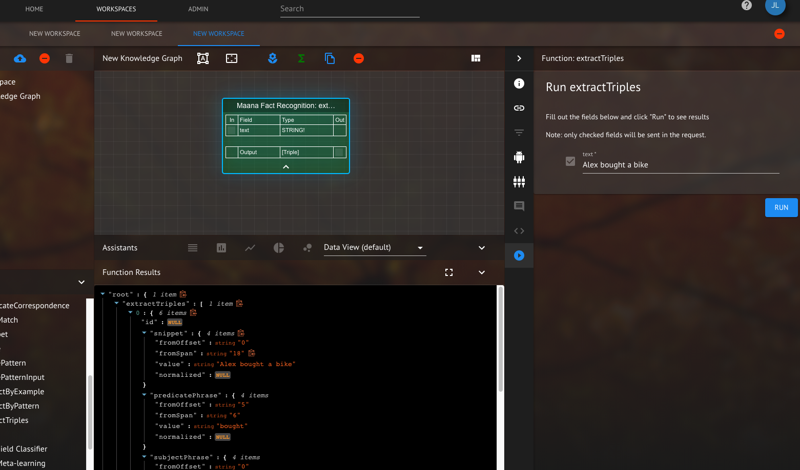
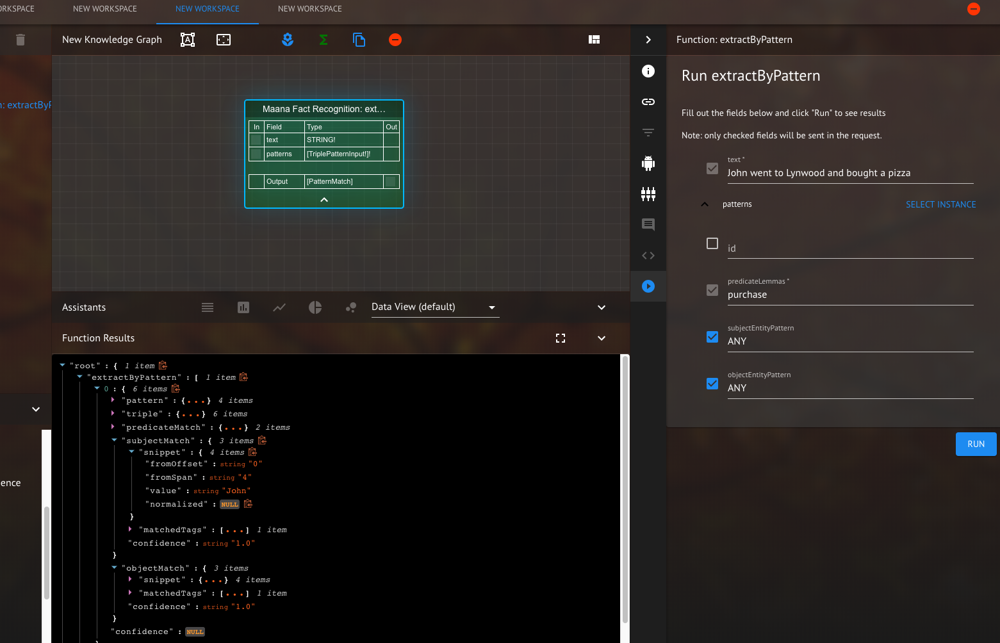
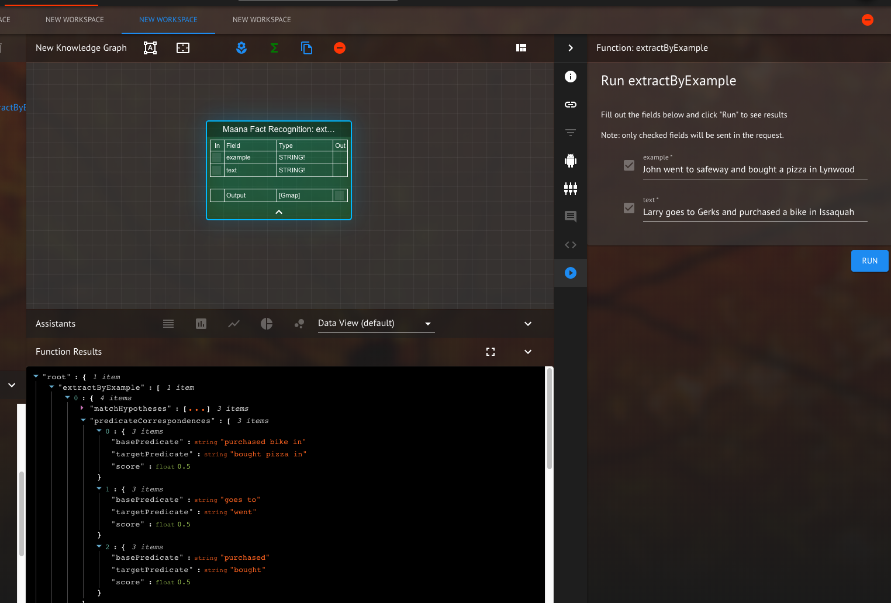

# Maana Fact Recognition

This service is used for extracting relations from text.  This service could extract information from the phrase "Alex bought a bicycle for 50$."  And store a series of triples "Alex", "bought", "bicycle" and "Alex", "bought a bicycle for", "50$".

## When might you want to use it
You may want to use these services if have unstructured text and want to extract person names, locations, or organizations.  In addition one can extract how people, locations, organizations ... are related to each other using the information extraction.

## How do you run/invoke it?
extractTriples extracts relations from the given string.  For example "Alex bought a bike" has subject "Alex", object "bike" and action "bought".  The query below extracts the relation "Alex","bought","bike"
<p><p>
</p>
<em>Figure 4: extractTriples query run in the function graph.</em>
</p>

```graphql
query {
    extractTriples(text: "Alex bought a bike") {
        predicatePhrase {
            value
        }
        subjectPhrase {
            value
        }
        objectPhrase{
            value
        }
    }
}
```
with result
```json
{
    "data": {
    "extractTriples": [
        {
        "predicatePhrase": {
            "value": "bought"
        },
        "subjectPhrase": {
            "value": "Alex"
        },
        "objectPhrase": {
            "value": "bike"
        }
        }
    ]
    }
}
```
extractByPattern applies a filter on top of extractTriples.  In the example below the patterns list is used to only return triples (subject, action, object) that match the given pattern class.  In the query below  the pattern to match is {predicateLemmas : ["purchase"], subjectEntityPatterns : ["ANY"], objectEntityPatterns : ["ANY"]} which is a filter that will match an action similar to "purchase", in this case "bought" and then match any subject and object. 
<p><p>
</p>
<em>Figure 4: extractByPattern query run in the function graph.</em>
</p>

```graphql
query {
    extractByPattern(text : "John went to Lynwood and bought a pizza", patterns : [{predicateLemmas : ["purchase"], subjectEntityPattern : ["ANY"], objectEntityPattern : ["ANY"]}]) {
    predicateMatch {
        snippet {
        value
        }
    }
    subjectMatch {
        snippet {
        value
        }
    }
    objectMatch {
        snippet {
        value
        }
    }
    }
}
```

with result
```json
{
    "data": {
        "extractByPattern": [
        {
            "predicateMatch": {
            "snippet": {
                "value": "bought"
            }
            },
            "subjectMatch": {
            "snippet": {
                "value": "John"
            }
            },
            "objectMatch": {
            "snippet": {
                "value": "pizza"
            }
            }
        }
        ]
    }
}
```
extractByExample uses an example sentence - computes the various triples within that sentence and then uses that as a pattern.  The pattern is applied to the given "text" and returns matches if they are found.  In the example below, the query will match "John" to "Larry", "went" to "goes", "safeway" ot "gerks", "pizza" to "bike" and "Lynwood" to "Issaquah".
<p><p>
</p>
<em>Figure 4: extractByExample query run in the function graph.</em>
</p>

```graphql
query {
    extractByExample(example : "John went to safeway and bought a pizza in Lynwood", text : "Larry goes to Gerks and purchased a bike in Issaquah") {
        predicateCorrespondences {
            basePredicate
            targetPredicate
        }
        entityCorrespondences {
            baseEntity
            targetEntity
        }
        score
    }
}
```

with result
```json
{
    "data": {
        "extractByExample": [
        {
            "predicateCorrespondences": [
            {
                "basePredicate": "goes to",
                "targetPredicate": "went"
            },
            {
                "basePredicate": "purchased",
                "targetPredicate": "bought"
            },
            {
                "basePredicate": "purchased bike in",
                "targetPredicate": "bought pizza in"
            }
            ],
            "entityCorrespondences": [
            {
                "baseEntity": "Gerks",
                "targetEntity": "safeway"
            },
            {
                "baseEntity": "Issaquah",
                "targetEntity": "Lynwood"
            },
            {
                "baseEntity": "Larry",
                "targetEntity": "John"
            },
            {
                "baseEntity": "bike",
                "targetEntity": "pizza"
            }
            ],
            "score": 13.5
        }
        ]
    }
}
```
