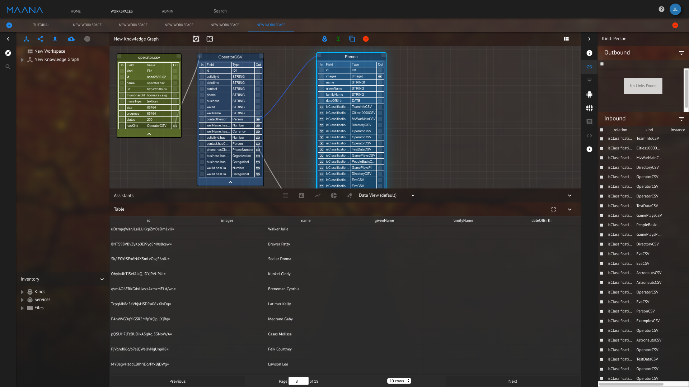

# Maana Field Classifier Assistant

The Field Classifier Service is a tool for classifying fields in tabular data.  It also allows you to query the classifications of those fields and add additional columns to the table with the explicit type (given by the classification).

## Field Classifier Using Function Composition

To start with, upload a CSV file, in this case we use [operator](operator.csv).  Load the data into the platform.  Bring the Kind for the operator.csv file into the workspace by clicking the link on the bottom of operator.csv - the Kind will be called "OperatorCSV".  As soon as the CSV file is uploaded the field classifier is kicked off and classifications for each of the columns of the tabular data are produced.  Possible classifications will show up as links in the "OperatorCSV" kind.  Critically, the data has two interesting classifications, "Person" and "Organization" for the fields "contact" and "business". 

<em>Figure 1: View after uploading CSV and Clicking on kind link</em>

The field classifier can also be run manually with function composition

Make sure the "OperatorCSV" is selected then in the assistants panel, select "Maana Field Classifier", this brings up the user interface for the field classifier.  In the upper left hand corner it should say "OperatorCSV"

<em>Figure 2: Field Classifier Assistant applied to OperatorCSV kind</em>

Scroll down to the fieldId "contact".  To the right there should be a "proposedType" of "Person" along with 2 buttons, "Add All" and "Add Matching".  When you click on one of these buttons it creates a new column of the "OperatorCSV" kind with the name "contactPerson" which is the concatenation of the original field name "contact" and the strong type "Person".

The "Add All" button adds all the data in the "contact" column to the new column "contactPerson".  The "Add Matching" button adds only the data that is classified as type "Person" to the "contactPerson" column - all other non matching records are empty.

There are also additional fields, the "Type" field is the original graphql type - STRING, FLOAT, BOOLEAN etc...  The ProposedType can contain any of the types available as classifications from the field classifier.  The Percent column gives an estimate of the percentage of records that matched a given classification, this is an estimate as only 1000 columns of the original data are used to produce the estimate.

When the "Add Matching" or "Add All" buttons are clicked the data from "contact" say, is added to the "Person" kind inside Maana.  The Ids for those instances are stored in the new "contactPerson" column.  In this way, multiple different kinds can refer to the same "Person", we then have a common location for "Person" data and associations between different data sources.

<em>Figure 3: A new column is added to OperatorCSV with Ids to the Person kind.</em>

<em>Figure 4: The Person kind is populated with new entries from the OperatorCSV "contact" field.</em>

## Using Strongly Typed Fields as Inputs to Functions
...  More on this later.

