# Maana Metalearning: Build classifier and classify data

Maana metalearning service is an automated machine learning service that builds machine learning pipelines for classification tasks under user's guidance. Given a kind, the user can specify feature fields and a label field, a decision space containing candidate featurizers, preprocessors and models. Metalearning service explores the decision space, builds up and tests pipelines, performs statistical analysis on their performances, and deliever insights to the user on the overall performances of each machine learning components, and the an overall best pipeline. The goal of metalearning service is to facilitate datascientists to quickly profile on data set, test their hypothesis and rapidly build new solutions.

## MetaLearning Service inside Platform

### Train Classifier

To start with, upload a CSV file, in this case we use [small_census](small_census.csv).  Load the data into the platform.  Bring the Kind for the small_census.csv file into the workspace by clicking the link on the bottom of small_census.csv - the Kind will be called "SmallCensusCSV".  As soon as the CSV file is uploaded the field classifier is kicked off and classifications for each of the columns of the tabular data are produced.  
<p><p>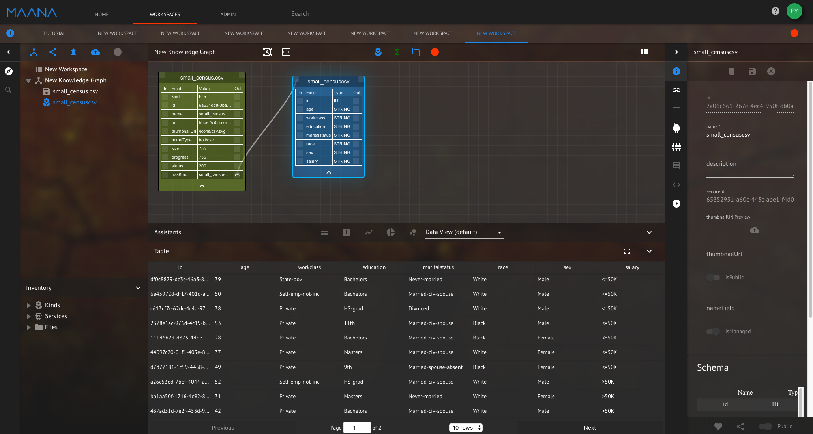
</p>
<em>Figure 1: View after uploading CSV and Clicking on kind link</em>
</p>

This kind contains instances that describe invididual's age, workclass, education, martialstatus, etc and its salary range. We want to build a classifier that predicate an individual's salary based on some of these features.

To trigger metalearning service, open the GraphQL interface of metalearning by Click "Maana Meta-learning" in "Inventory" panel:

<p><p>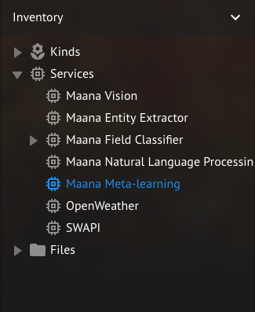
</p>
<em>Figure 2: Open MetaLearning GraphQL interface from Inventory</em>
</p>

From the GraphiQL interface, use TrainClassifierKind mutation to train a classifier for SmallCensusCSV

<p><p>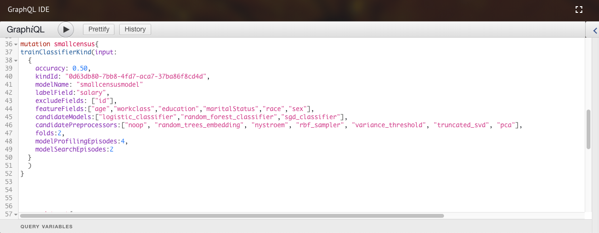
</p>
<em>Figure 3: Train Classifier from kind SmallCensusCSV</em>
</p>

```
mutation smallcensus {
  trainClassifierKind(input:{
    accuracy:0.5,
    kindId:"KindID",
    modelName:"SmallCensusModel", # Must be unique, not previously used
    labelField: "salary",
    excludeFields: ["id"],
    featureFields: ["age", "workclass", "education", "maritalstatus", "race", "sex"],
    featureTypes: ["integer", "categorical", "categorical", "categorical", "categorical", "categorical"],
    candidateModels: ["random_forest_classifier", "logistic_classifier"],
    candidatePreprocessors: ["noop", "pca"],
    folds:2,
    modelSearchEpisodes:2,
    modelProfilingEpisodes:4
  })
}
```

In the above mutation, the kindID field is filled in with the id of kind "SmallCensusCSV". The user gives a model name, and identify label field, feature fields, candidate models and candidate preprocessors. The user also specifies to perform 2-fold cross validation for model selection, and perform 4 episodes of hyper-parameter sampling and 2 episodes of hyper-parameter search.


To visualize the results, search for kind "Dataset", and drag the search result "Kind: DataSet" to the workspace, then click the link at finalModel.  Do not select the result "Maana Meta Learning: Kind: Dataset", as that is the type associated with the service, not where the results are currently stored. The kind MachineLearningModel will show on the canvas.  

<p><p>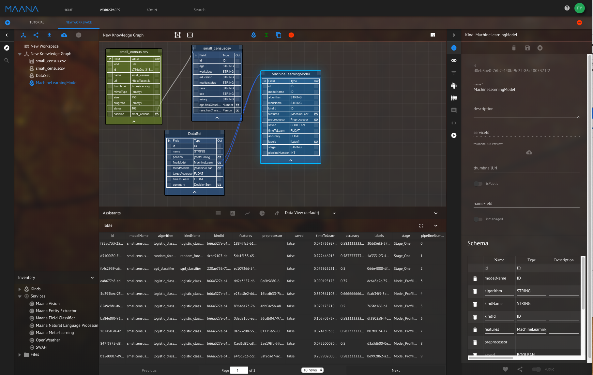
</p>
<em>Figure 4: Trained machine learning models</em>
</p>

From the dataview panel, it shows each pipeline that has been built and tested, including its model, features, preprocessors, time to learn, accuray, and the stage they are tested. Look for the pipeline where "saved" is "True": this is the final pipeline that is built as the best.


<p><p>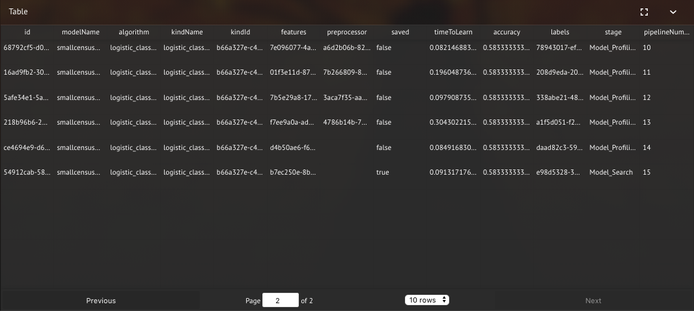
</p>
<em>Figure 5: Built model</em>
</p>

Following the link of features, preprocessor and labels you can see the kind that stores the detailed information:

<p><p>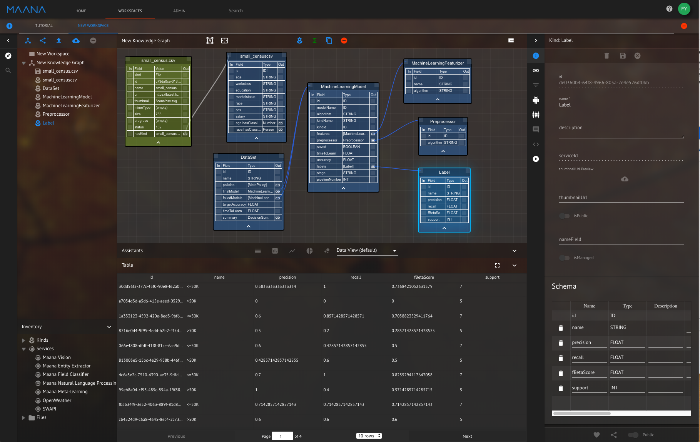
</p>
<em>Figure 6: Detailed information in Kinds</em>
</p>


<p><p>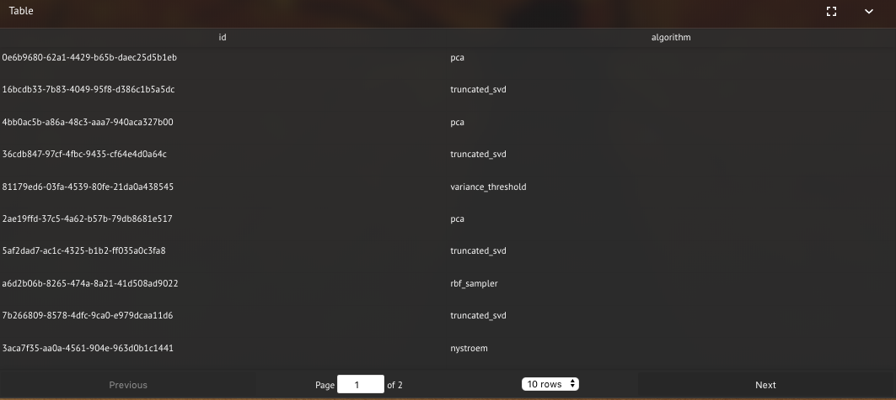
</p>
<em>Figure 7: Preprocessor information in Kind</em>
</p>

<p><p>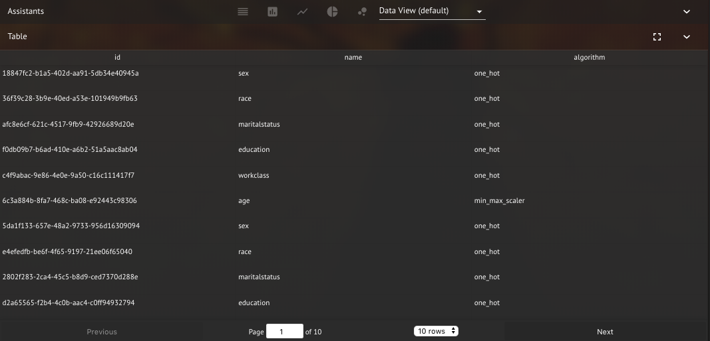
</p>
<em>Figure 8: Featurizer information in Kind</em>
</p>

### Classify Instance

Using mutation ClassifyInstance, the user can use a trained model to classify instance.

<p><p>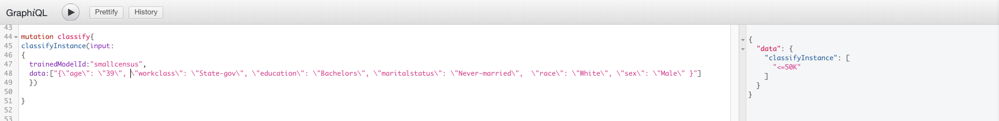
</p>
<em>Figure 9: Classify instance</em>
</p>

```
mutation classify {
  classifyInstance(input: {
    trainedModelId: "SmallCensusModel",
    data:["{\r\n  \"age\": \"39\",\r\n  \"workclass\":\" State-gov\",\r\n  \"fnlwgt\":\" 77516\",\r\n  \"education\":\" Bachelors\",\r\n\t\"educationnum\":\" 13\",\r\n  \"maritalstatus\":\" Never-married\",\r\n  \"occupation\":\" Adm-clerical\",\r\n  \"relationship\":\" Not-in-family\",\r\n  \"race\":\" White\",\r\n  \"sex\":\" Male\",\r\n  \"capitalgain\":\" 2174\",\r\n  \"capitalloss\":\" 0\",\r\n  \"hoursperweek\":\" 40\",\r\n  \"nativecountry\":\" United-States\"\r\n}"]
  })
}
```

### Classify Kind

Using mutation ClassifyKind, the user can use a trained model to classify a kind and make prediction to be a new column. To do this, drag csv file [small_census_new](small_census_new.csv) to your workspace. This csv file contains all feature fields of smallcensus, but there is no field for salary. After the CSV file is loaded to workspace, click the link to the kind small_census_newcsv and preview the data

<p><p>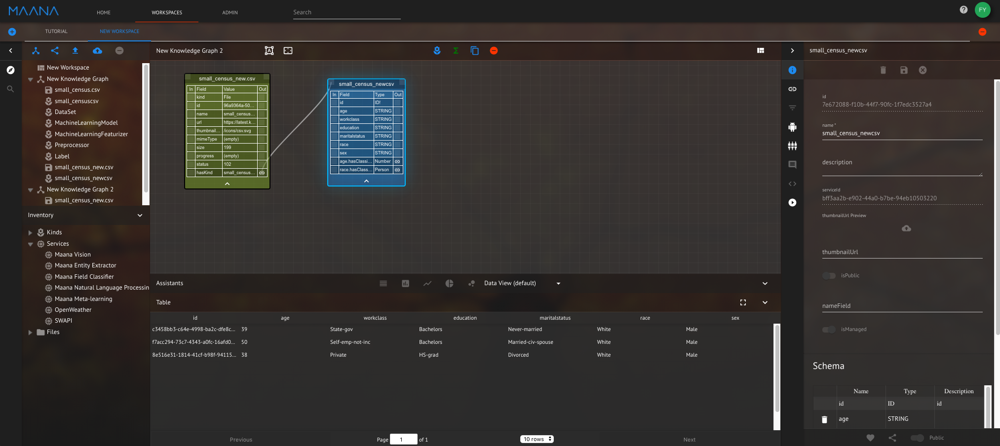
</p>
<em>Figure 10: Create a Kind for Classification</em>
</p>

Now use the following mutation

<p><p>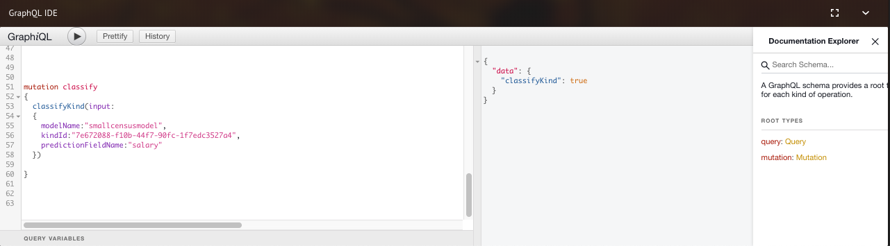
</p>
<em>Figure 11: Classify Kind</em>
</p>

```
mutation classify
{
  classifyKind(input:
  {
    trainedModelId:"SmallCensusModel",
    fromKindId:"<insert kind id>",
    fromInstanceIdentifierFieldName:"salary"
  }
  )
}
```

Now go back to the workspace, a new field "salary" is added to small_census_newcsv kind with the classification results


<p><p>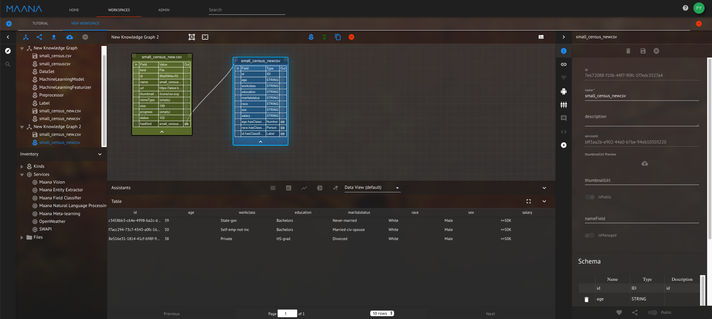
</p>
<em>Figure 12: Result of classifying kind</em>
</p>
