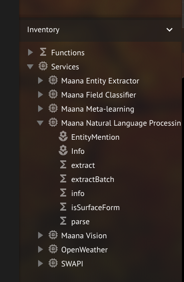
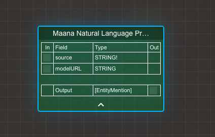
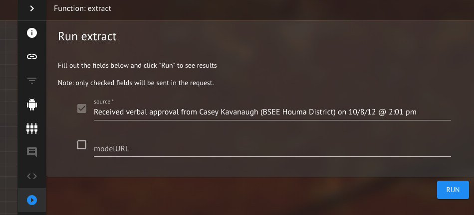
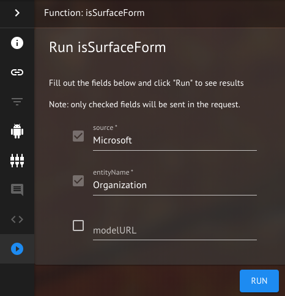
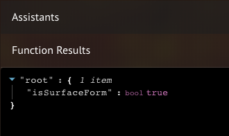
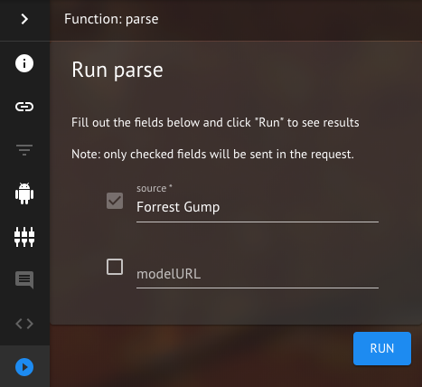
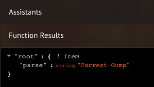

# Maana Named Entity Recognition (NER) service

The Maana-NER-service is for identifying entities in text and identifying their location within that text.
It using two approaches:

- Stochastic method - Stanford CRF Classifier (Conditional Random Field: https://en.wikipedia.org/wiki/Conditional_random_field) and
- Deterministic method - Tokens Regex: https://stanfordnlp.github.io/CoreNLP/tokensregex.html

## What is the service for

In particular, the service uses a stochastic approach so it can identify entities that are not explicitly present in the training set. For example, it could identify "Zack" as a name, even if "Zack" is not mentioned in the training data. The approach being used takes into account the context of words in a sentence to determine if they belong to a particular class of entity.

## Detected Entities:

| n   | Entity               | CRF | Regex |
| :-- | :------------------- | :-- | :---- |
| 01  | DateKind             | +   | +     |
| 02  | TimeKind             | +   | +     |
| 03  | Person               | +   | -     |
| 04  | Location             | +   | -     |
| 05  | Organization         | +   | -     |
| 06  | Currency             | +   | -     |
| 07  | Number               | +   | -     |
| 08  | Percentage           | +   | -     |
| 09  | URL                  | -   | +     |
| 10  | Email                | -   | +     |
| 11  | PhoneNumber          | -   | +     |
| 12  | SocialSecurityNumber | -   | +     |
| 13  | IpAddress            | -   | +     |
| 14  | WebLink              | -   | +     |
| 15  | GeoCoordinate        | -   | +     |

## When might you want to use it

This service is important as part of a pipeline where

1.  Simply identify what text contains a particular entity.
2.  Detect multiple entities in text - this could be used in co occurrence computations where the user wants to identify a person along with a well type.
3.  The entities can be used as part of a pipeline in a larger pattern matching scheme - for example to identify phrases that have a person followed by a date (and then extract additional information using pattern based methods).
4.  As a first step in an information extraction pipeline to help fill in tables.

## How to use it? Example of queries

### Extract

Examples of "extract" query to run with default Model.

```graphql
query Extract {
  extract(
    source: "John, please get that article on www.linkedin.com or https://google.com or 192.67.23.222 and files: bla123bla.doc and itisme.jpg and send to me by 5:00PM on Jul 4th 2018 or 4:00 am on 01/09/12 would be ideal, actually. If you have any questions about \"Microsoft\" or 'Google' office at \"New York\" you can reach my associate at (012)-345-6789 or (230) 241 2422 or +1(345)876-7554 or associative@mail.com or &lt;abracadabra123@maana.io>. Send me $5,987.56 or £4,123.14 or € 100 by PayPal. My SSN is 456-23-0965 My coordinates are: 47.617640, -122.191905 or 47°37'03.5\"N 122°11'30.9\"W"
   
  ) {
    entityName
    surfaceForm
    fromSpan
    fromOffset
  }
}
```

<details style="color:green">
<summary>click to expand output results</summary>
<p>

```graphql
{
  "data": {
    "extract": [
      {
        "entityName": "Person",
        "surfaceForm": "John",
        "fromSpan": "4",
        "fromOffset": "0"
      },
      {
        "entityName": "URL",
        "surfaceForm": "www.linkedin.com",
        "fromSpan": "16",
        "fromOffset": "33"
      },
      {
        "entityName": "URL",
        "surfaceForm": "https://google.com",
        "fromSpan": "18",
        "fromOffset": "53"
      },
      {
        "entityName": "IpAddress",
        "surfaceForm": "192.67.23.222",
        "fromSpan": "13",
        "fromOffset": "75"
      },
      {
        "entityName": "TimeKind",
        "surfaceForm": "5:00PM on",
        "fromSpan": "9",
        "fromOffset": "147"
      },
      {
        "entityName": "DateKind",
        "surfaceForm": "Jul 4th 2018",
        "fromSpan": "12",
        "fromOffset": "157"
      },
      {
        "entityName": "TimeKind",
        "surfaceForm": "4:00 am on",
        "fromSpan": "10",
        "fromOffset": "173"
      },
      {
        "entityName": "DateKind",
        "surfaceForm": "01/09/12",
        "fromSpan": "8",
        "fromOffset": "184"
      },
      {
        "entityName": "Organization",
        "surfaceForm": "Microsoft",
        "fromSpan": "9",
        "fromOffset": "252"
      },
      {
        "entityName": "Organization",
        "surfaceForm": "Google",
        "fromSpan": "6",
        "fromOffset": "267"
      },
      {
        "entityName": "Location",
        "surfaceForm": "New York",
        "fromSpan": "8",
        "fromOffset": "286"
      },
      {
        "entityName": "PhoneNumber",
        "surfaceForm": "(012)-345-6789",
        "fromSpan": "14",
        "fromOffset": "326"
      },
      {
        "entityName": "PhoneNumber",
        "surfaceForm": "(230) 241 2422",
        "fromSpan": "14",
        "fromOffset": "344"
      },
      {
        "entityName": "PhoneNumber",
        "surfaceForm": "+1(345)876-7554",
        "fromSpan": "15",
        "fromOffset": "362"
      },
      {
        "entityName": "Email",
        "surfaceForm": "associative@mail.com",
        "fromSpan": "20",
        "fromOffset": "381"
      },
      {
        "entityName": "Currency",
        "surfaceForm": "$5,987.56",
        "fromSpan": "9",
        "fromOffset": "443"
      },
      {
        "entityName": "Currency",
        "surfaceForm": "£4,123.14",
        "fromSpan": "9",
        "fromOffset": "456"
      },
      {
        "entityName": "Currency",
        "surfaceForm": "€ 100",
        "fromSpan": "5",
        "fromOffset": "469"
      },
      {
        "entityName": "Organization",
        "surfaceForm": "PayPal",
        "fromSpan": "6",
        "fromOffset": "478"
      },
      {
        "entityName": "SocialSecurityNumber",
        "surfaceForm": "456-23-0965",
        "fromSpan": "11",
        "fromOffset": "496"
      },
      {
        "entityName": "GeoCoordinate",
        "surfaceForm": "47.617640, -122.191905",
        "fromSpan": "22",
        "fromOffset": "528"
      },
      {
        "entityName": "GeoCoordinate",
        "surfaceForm": "47°37'03.5\"N 122°11'30.9\"W",
        "fromSpan": "26",
        "fromOffset": "554"
      }
    ]
  }
}
```

</p>
</details>

### Extract with customer Model or Token-Regex rules

Example of extract query to run with customer model. It returns an array of entities.
You can drag & drop you crf model file to Maana, copy url, uncomment model URL and paste into query.

```graphql
query ExtractWithModelOrRegex {
  extract(
    source: "Daily update notification made to BSEE Houma District, Bobby Nelson." #, modelURL: "http://.../your_awesome_crf_model.ser.gz"
  ) {
    fromSpan
    fromOffset
    entityName
    surfaceForm
  }
}
```

<details style="color:green">
<summary>click to expand output results</summary>
<p>

```graphql
{
  "data": {
    "extract": [
      {
        "entityName": "Organization",
        "surfaceForm": "BSEE",
        "fromSpan": "4",
        "fromOffset": "34"
      },
      {
        "entityName": "Location",
        "surfaceForm": "Houma District",
        "fromSpan": "14",
        "fromOffset": "39"
      },
      {
        "entityName": "Person",
        "surfaceForm": "Bobby Nelson",
        "fromSpan": "12",
        "fromOffset": "55"
      }
    ]
  }
}
```

</p>
</details>

There is also a capability to use customer’s Token-Regex rules if specify path to Regex.rules in modelURL parameter.

### Batch Extract

Example of "batch extract" query - it takes a list of source text and returns an array of array of entities, one array for each source.

```graphql
query BatchExtract {
  extractBatch(
    sources: [
      "Received verbal approval from Casey Kavanaugh (BSEE Houma District) on 10/8/12 @ 2:01 pm"
      "David Stanley lives in Lake Charles and works for MMS."
    ] #, modelURL: "http://.../your_awesome_crf_model.ser.gz"
  ) {
    fromSpan
    fromOffset
    entityName
    surfaceForm
  }
}
```

<details style="color:green">
<summary>click to expand output results</summary>
<p>

```graphql
{
  "data": {
    "extractBatch": [
      [
        {
          "entityName": "Person",
          "surfaceForm": "Casey Kavanaugh",
          "fromSpan": "15",
          "fromOffset": "30"
        },
        {
          "entityName": "Organization",
          "surfaceForm": "BSEE",
          "fromSpan": "4",
          "fromOffset": "47"
        },
        {
          "entityName": "Location",
          "surfaceForm": "Houma District",
          "fromSpan": "14",
          "fromOffset": "52"
        },
        {
          "entityName": "DateKind",
          "surfaceForm": "10/8/12",
          "fromSpan": "7",
          "fromOffset": "71"
        },
        {
          "entityName": "TimeKind",
          "surfaceForm": "2:01 pm",
          "fromSpan": "7",
          "fromOffset": "81"
        }
      ],
      [
        {
          "entityName": "Person",
          "surfaceForm": "David Stanley",
          "fromSpan": "13",
          "fromOffset": "0"
        },
        {
          "entityName": "Location",
          "surfaceForm": "Lake Charles",
          "fromSpan": "12",
          "fromOffset": "23"
        },
        {
          "entityName": "Organization",
          "surfaceForm": "MMS",
          "fromSpan": "3",
          "fromOffset": "50"
        }
      ]
    ]
  }
}
```

</p>
</details>

### Is Surface Form

Example of "is surface form" query - returns true if a particular source is exactly a surface form of "entityName"

```graphql
query IsSurfaceForm {
  isSurfaceForm(source: "Seattle", entityName: "Location")
}
```

<details style="color:green">
<summary>click to expand output results</summary>
<p>

```graphql
{
  "data": {
    "isSurfaceForm": true
  }
}
```

</p>
</details>

### Is Surface Form with customer Model

```graphql
query IsSurfaceFormWithModel {
  isSurfaceForm(
    source: "BOEM"
    entityName: "Organization"
    #, modelURL: "http://.../your_awesome_crf_model.ser.gz"
  )
}
```

<details style="color:green">
<summary>click to expand output results</summary>
<p>

```graphql
{
  "data": {
    "isSurfaceForm": true
  }
}
```

</p>
</details>

### Parse

Example of parse query:

- returns the parsed entity name if the source text is exactly as entity with no additional text to the left or right of the entity,
- otherwise return empty string.

```graphql
query Parse {
  parse(
    source: "Forrest Gump"
    #, modelURL: "http://.../your_awesome_crf_model.ser.gz"
  )
}
```

<details style="color:green">
<summary>click to expand output results</summary>
<p>

```graphql
{
  "data": {
    "parse": "Forrest Gump"
  }
}
```

</p>
</details>

```graphql
query Parse {
  parse(
    source: "I visited my friend Forrest Gump"
    #, modelURL: "http://.../your_awesome_crf_model.ser.gz"
  )
}
```

<details style="color:green">
<summary>click to expand output results</summary>
<p>

```graphql
{
  "data": {
    "parse": ""
  }
}
```

</p>
</details>

## Using service functions with Maana

Create new Workspace and expand 'Inventory' (bottom left)

<p><p>
</p>
<em>Figure 1: Expend 'Inventory': 'Services' -> 'Maana Natural Language Processing'</em>
</p>

Then you can drag & drop any service function to you workspace canvas:

### extract

Drag & drop 'extract' function. On the canvas you'll see new Kind - Extract function Kind.

<p><p>
</p>
<em>Figure 2: Extract function Kind.</em>
</p>

Click on 'triangle in circle' at the bottom of thin vertical bar on the right (see Figure 3).

- Type you text into 'source' field.
- As an option you can define CRF Model by typing modelURL and marked check box. But before it you nedd drag & drop your CRF Model to canvas and copy URL (on the right).

<p><p>
</p>
<em>Figure 3: To extract entities click 'RUN' button.</em>
</p>

You will see the results (extracted entities) in the bottom section.

<p><p>
</p>
<em>Figure 4: Results of extraction (click to expand blue triangles).</em>
</p>

### isSurfaceForm

- Drag & drop 'isSurfaceForm' function. On the canvas you'll see new Kind - isSurfaceForm function Kind.
- Click on 'triangle in circle' at the bottom of thin vertical bar on the right.
- Type your entity in 'source' field.
- Type expected entity name in 'entityName' field (see all entity names in paragraph "Detected Entities" in this tutorial above).
- Define 'modelURL' if you want to.
- Click 'RUN' button. See results in the bottom section.

<p><p>
</p>
<em>Figure 5: To detect is it surface form click 'RUN' button.</em>
</p>
<p><p>
</p>
<em>Figure 6: Results of if 'Microsoft' is surface form of 'Organization' type.</em>
</p>

### parse

- Drag & drop 'parse' function. On the canvas you'll see new Kind - parse function Kind.
- Click on 'triangle in circle' at the bottom of thin vertical bar on the right.
- Type your entity in 'source' field.
- Define 'modelURL' if you want to.
- Click 'RUN' button. See results in the bottom section.

<p><p>
</p>
<em>Figure 7: To parse entity click 'RUN' button.</em>
</p>
<p><p>
</p>
<em>Figure 8: Results of parsing 'Forrest Gump' entity.</em>
</p>
