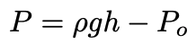
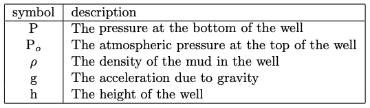
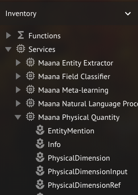
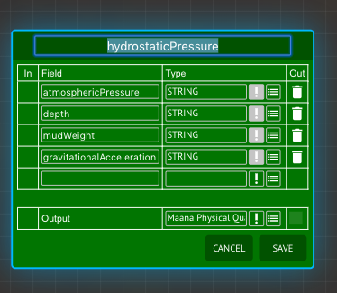
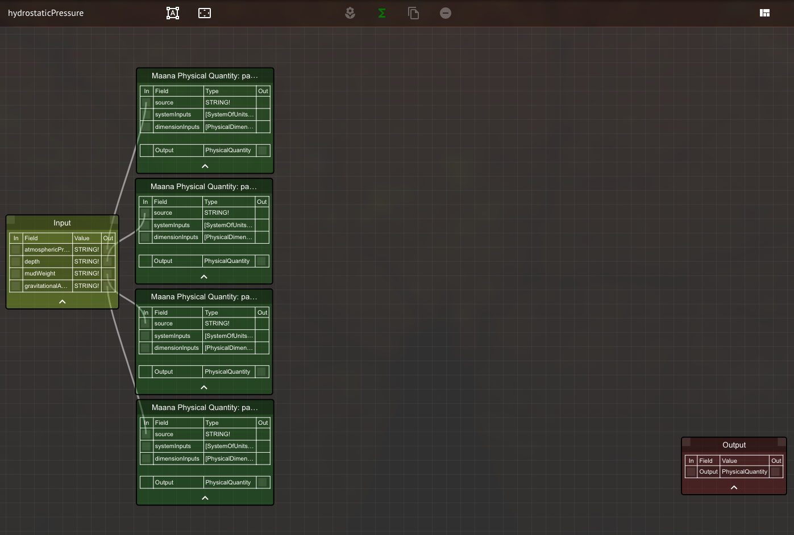
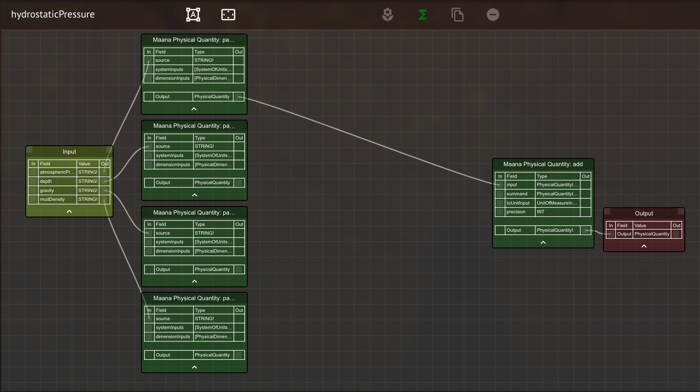
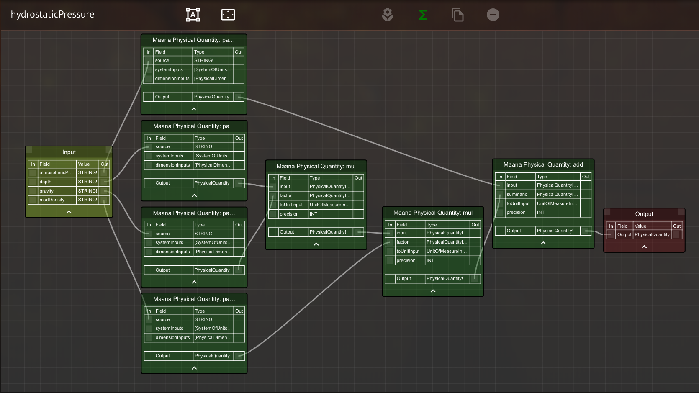
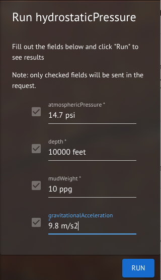
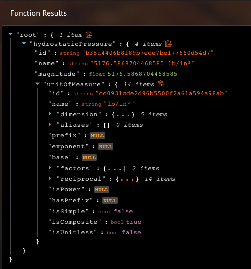

# Maana Physical Quantity: Dimensionally Safe Computations with Measurements

The Maana Physical Quantity service provides extensive capabilities for extracting physical quantities ( a.k.a. measured quantities) from text, and performing arithmetic, unit conversions and comparisons with them. This service uses a proprietery symbolic computing engine built on top of Stanford CoreNLP's named entity recognition library (https://nlp.stanford.edu/software/).   The service provides a graphQL interface which can be used in conjunction with functional composition to rapidly deploy scientific and engineering solutions.   The system ensures that all computations are dimensionally consistent and comes preinstalled with familiar metric, Imperial and oil and gas units of measure.

## Using Physical Quantities With Functional Composition

In this example we will create a new function that uses the physical quantity service to parse physical quantities from strings, and perform a dimensionally consistent computation with them.

### The Problem
You would like to know the absolute pressure at the bottom of a well, and are given strings containing the atmospheric pressure, the depth of the well, the mud weight and the acceleration due to gravity.  The computation that you would like to perform is described by the following formula:

<em>Equation 1: Hydrostatic Pressure Computation </em>

For dimensional consistency, the gauge pressure, the atmospheric pressure and the hydrostatic head (ρgh) all have to have a physical dimension of FORCE/AREA.  Furthermore, for unit consistency they all must have the same unit of measure.   For this example, we will assume that you want the final pressure to be in the same unit of measure as the atmospheric pressure that is provided.

### The Solution
Create a new workspace and ensure that the Physical Quantity service is registered and appears in the "Inventory" panel:

<em>Figure 1: Ensure that the Physical Quantity service is in the Inventory</em>

If the physical quantity service is not in the inventory of your workspace, perform a search for "Physical Quantity" and drag the service from the search results onto the inventory.

Create a new function by clicking on the add function button (the green "Σ") on the workspace toolbar.   Name it "hydrostaticPressure" and configure it with four mandatory STRING! inputs: atmosphericPressure, depth, mudWeigth and gravitationalAcceleration.   Change the output type to "Maana Physical Quantity:PhysicalQuantity".  When you are done, it should look like the Figure 2.

<em>Figure 2: Create a new Function on the Canvas</em>

Save the function and then open up its function graph.

Before you can perform the arithmetic computations with the physical quantities, you must deserialize them from the strings that you are given.   The deserialization is performed by the physical quantity service's "parse" function.  Find the parse function in the inventory, and drag four copies of it onto the canvas.   Connect each of the function's STRING! valued inputs to the "source" argument of a different parse function.   When you are done, your query graph should look like figure 3.

<em>Figure 3: Parse the Physical Quantities from the Provided Strings.</em>

Note that the parse function has optional parameters that allow the user restrict which system of units and physical dimensions are used when parsing.   We will demonstrate the use of these optional parameters in a future tutorial.

Next drag a copy of the "add" function onto the canvas.   Connect the parsed atmospheric pressure to the input of the add function.   Then, connect the output of the add function to the Output of the function.  NOTE: Since the "add" function will have the same unit of measure as its first argument, this ensure that the output will be in the desired unit of measure.   

When you are done, the function graph should look like figure 4:

<em>Figure 4: Processing the Atmospheric Pressure.</em>

To complete the function, you need to multiply the depth, mudWeight and gravitationalAcceleration together, and add this to the atmospheric pressure.   Multiplication is performed by the physical quantity's "mul" function.   Drag two copies onto the canvas and connect them as depicted in figure 4.

<em>Figure 4: Add the Terms Together.</em>

### Using the Function

Close the function graph by selecting the Knowledge Graph of your workspace.   Click on the hydrostaticPressure function and then select the "Run" tab on the context panel.   You will be prompted to enter in values for the atmospheric pressure, depth, mud density and gravitational acceleration.    Fill in the values below and then press the run button:

<em>Figure 5: Entering Parametrs for the Hydrostatic Pressure Function.</em>

After a short period of time, the results from the computation will be displayed in the context panel.

<em>Figure 5: Hydrostatic pressure results</em>

## Where to Find More Information

The physical quantity service supports many more functions.   For a complete description of all its capabilities, please consult the Q-Guide at https://github.com/maana-io/q-guides/blob/master/services/scientist/maana-physical-quantity.md
